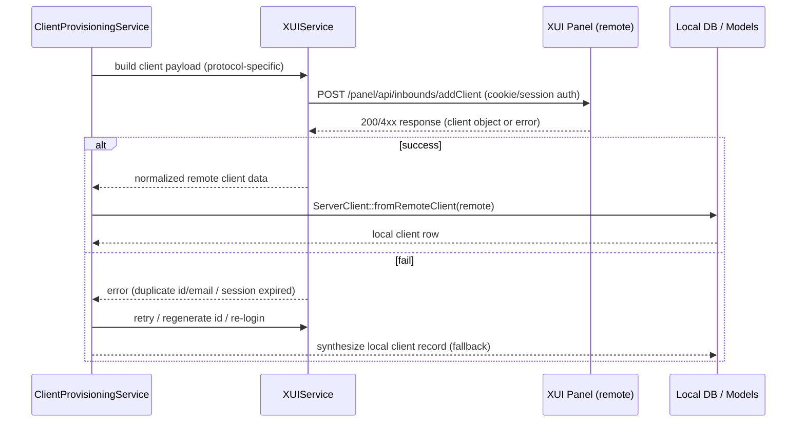

# Provisioning Workflows (XUI)

This document contains visual workflows (Mermaid diagrams) to help you understand how orders, plans, inbounds and clients are created on the remote XUI panel and persisted locally in the app.

Checklist
- [x] High-level end-to-end provisioning flow
- [x] Plan -> provision mode mapping (dedicated / shared / branded / reseller / single / multiple)
- [x] Dedicated inbound creation subflow (port allocation, placeholder, remote create, adopt locally)
- [x] Shared inbound/client provisioning flow
- [x] Client creation sequence (protocol shaping -> XUI API -> local persistence)
- [x] Error handling, retries and fallback visual
- [x] Sync flow (remote -> local)

Notes: These diagrams map to the code in `app/Services/ClientProvisioningService.php`, `app/Services/XUIService.php`, and the models `app/Models/Server.php`, `app/Models/ServerInbound.php`, `app/Models/ServerClient.php`, `app/Models/ServerPlan.php`.

## How to view
- GitHub and GitLab render Mermaid diagrams in Markdown; open `docs/PROVISIONING_WORKFLOWS.md` in the repository web UI.
- In VS Code, install "Markdown Preview Enhanced" or "Markdown Preview Mermaid Support" to render diagrams in the editor preview.

---

## 1) High-level end-to-end provisioning

```mermaid
flowchart LR
  O[Order placed] --> D{determineProvisionMode(order.item.plan)}
  D -->|dedicated| DI[Create dedicated inbound]
  D -->|shared| SI[Use shared inbound]
  D -->|branded / reseller| BR[Branded / Reseller mapping]
  DI --> RC[Create remote client on inbound]
  SI --> RC
  BR --> RC
  RC --> LC[Persist ServerClient & OrderServerClient]
  LC --> N[Notify success / update order status]
  RC -->|fail| RF[apply fallback & synthesize local client]
  RF --> LC
```

Short: order -> determineProvisionMode -> either allocate dedicated inbound or select shared inbound -> create remote client via XUIService -> persist local client and order mapping.

## 2) Provision mode decision (plan types)

```mermaid
flowchart TD
  P[ServerPlan] -->|provisioning_type| PT{provisioning_type}
  PT -->|dedicated| DED[Dedicated mode]
  PT -->|shared| SH[Shared mode]
  PT -->|single| SNG[Single-client inbound]
  PT -->|multiple| MUL[Multiple-clients inbound]
  PT -->|branded| BR[Branded: treat as shared with custom branding]
  PT -->|reseller| RS[Reseller: may create aggregated dedicated inbounds]
  note right of BR
    Branded/reseller flows may include
    additional metadata and mapping
  end
```

Notes: The code uses `determineProvisionMode()` with plan flags and heuristics (capacity, server rules, order item count) to map plan -> provisioning mode. Dedicated plans trigger `createDedicatedInbound()`.

## 3) Dedicated inbound creation subflow

```mermaid
flowchart LR
  A[determine -> dedicated] --> B[allocateAvailablePort(server, plan)]
  B --> C{reserve placeholder inbound row}
  C --> D[build inbound payload (protocol, port, settings)]
  D --> E[XUIService.createInbound(payload)]
  E -->|success| F[mark inbound provisioning_just_created = true]
  F --> G[createRemoteClient(on new inbound)]
  G --> H[persist ServerInbound, ServerClient, OrderServerClient]
  E -->|fail| R[retry/rollback placeholder & try alternative server or fail]
```

Details: Port allocation is transactional: a placeholder local inbound row may be created to reserve the port. After remote creation, the local inbound is updated from remote data and flagged as just created to allow immediate client creation.

## 4) Shared inbound flow (typical)

```mermaid
flowchart LR
  S[determine -> shared] --> L[findBestSharedInbound(server, plan)]
  L -->|found & capacity| G[createRemoteClient(on shared inbound)]
  L -->|no capacity| HANDOFF[choose alternate inbound or create dedicated]
  G --> H[persist ServerClient & OrderServerClient]
```

Notes: `ServerInbound::canProvision()` checks capacity (max_clients_per_inbound / current_clients). If capacity is reached, provisioning either picks another inbound or falls back to dedicated depending on config.

## 5) Client creation sequence (call chain)



Details: Payload shaping depends on protocol (vless/vmess/trojan/ss/socks/wireguard). Some fields must be JSON-encoded strings to match older panels; `XUIService` normalizes these.

## 6) Protocol shaping overview

```mermaid
flowchart LR
  subgraph protocol
    VLESS[VLESS]
    VMESS[VMESS]
    TROJAN[TROJAN]
    SS[Shadowsocks]
    WG[WireGuard]
    SOCKS[SOCKS]
  end

  VLESS -->|settings| S1[uuid, flow, encryption, network(ws/tcp/kcp)]
  VMESS -->|settings| S2[uuid, alterId, security, network]
  TROJAN -->|settings| S3[password, email, network]
  SS -->|settings| S4[method, password, plugin]
  WG -->|settings| S5[public/private keys, endpoint]
  SOCKS -->|settings| S6[username/password (sometimes)]

  note right of protocol
    ClientProvisioningService generates the correct
    structure for each protocol. XUIService ensures
    nested JSON / headers are encoded as expected.
  end
```

## 7) Error handling & fallback

```mermaid
flowchart LR
  Try[attempt createRemoteClient] -->|success| OK[persist local]
  Try -->|transient error| Retry[retry (login, regenerate id, delay)]
  Retry --> Try
  Try -->|fatal| Synthesize[synthesize local client & mark failed_remote=true]
  Synthesize --> Notify[notify ops / record debug snapshot]
```

Notes: The code writes debug snapshots to storage when failures occur (useful for tests). Config flags like `xui.allow_fallback_update` and `provision.keep_dedicated` change behavior.

## 8) Sync flow (periodic reconciliation)

```mermaid
flowchart LR
  Cron --> XUIService[fullSync()]
  XUIService --> XUIP: list inbounds / list clients per inbound
  XUIP --> XUIService: remote objects
  XUIService --> DB: update ServerInbound::updateFromXuiApiData()
  XUIService --> DB: ServerClient::fromRemoteClient() (update or create)
```

This keeps the local database in sync with the panel (useful after manual changes on the panel or failed provisions).

---

If you want, I can:
- Convert these diagrams into PNG/SVG files and add them to `docs/` (requires a mermaid CLI or a rendering step in CI), or
- Add inline links in the three key code files (`ClientProvisioningService.php`, `XUIService.php`, `ServerInbound.php`) pointing back to these diagrams for maintainers.

Requirements coverage
- Visual workflows file created: DONE (`docs/PROVISIONING_WORKFLOWS.md`)

Next steps
- Tell me if you want PNG/SVG exports or a PR adding references in code; I can generate a small PR with those changes.
